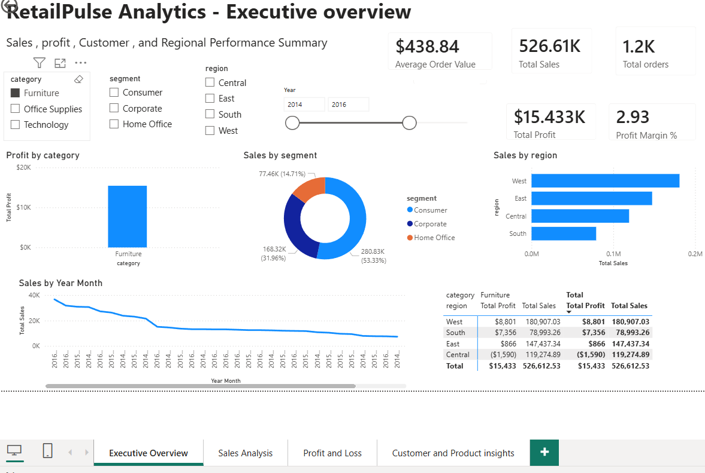
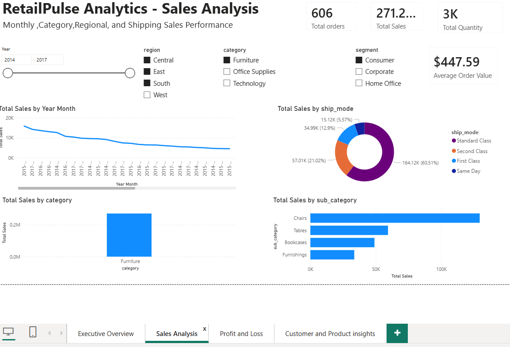
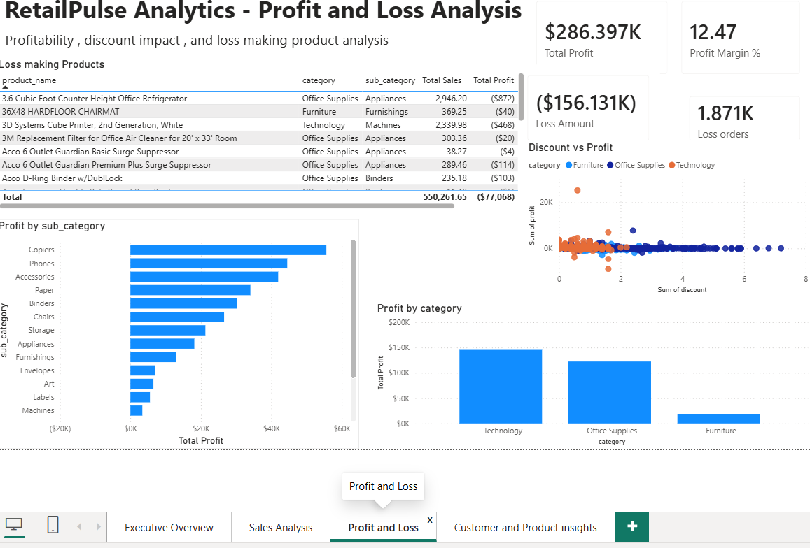
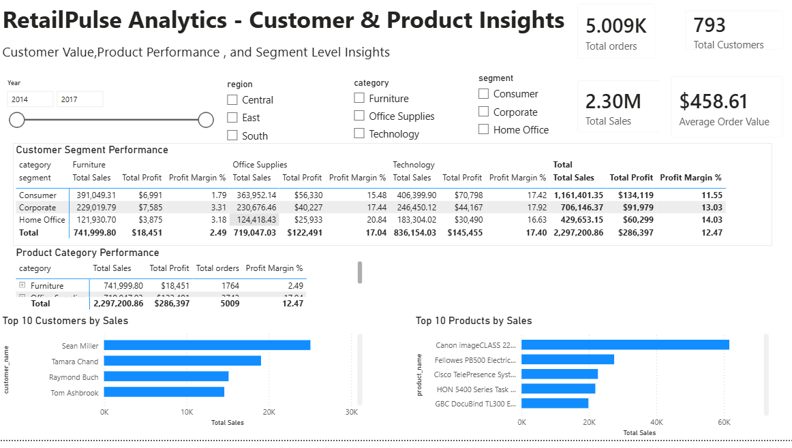

# RetailPulse Analytics

RetailPulse Analytics is an end-to-end retail data analytics project built using SQL, Python, Pandas, NumPy, Matplotlib, Seaborn, MySQL, and Power BI.

The project analyzes sales performance, profit and loss, customer behavior, product performance, discount impact, and regional trends.

## Problem Statement

A retail company wants to understand its sales, profit, customer segments, product performance, and regional business trends. The goal is to identify business problems and provide data-driven recommendations.

## Tools & Technologies Used

- Python
- Pandas
- NumPy
- Matplotlib
- Seaborn
- MySQL
- Power BI
- GitHub

## Project Workflow

1. Collected retail sales dataset
2. Performed initial data exploration in Jupyter Notebook
3. Cleaned and transformed the dataset
4. Created business columns such as profit margin, profit status, sales category, discount level, and shipping days
5. Performed data visualization using Matplotlib and Seaborn
6. Created MySQL database and wrote business analysis queries
7. Built interactive Power BI dashboard
8. Generated business insights and recommendations

## Dashboard Pages

1. Executive Overview
2. Sales Analysis
3. Profit & Loss Analysis
4. Customer & Product Insights

## Key Analysis Performed

- Total sales and profit analysis
- Monthly sales trend
- Region-wise sales analysis
- Category and sub-category performance
- Customer segment analysis
- Top customers by sales
- Top products by sales
- Loss-making product analysis
- Discount impact on profit
- Shipping mode performance

## SQL Analysis

The project includes MySQL queries for:

- Total sales
- Total profit
- Total orders
- Total customers
- Sales by region
- Profit by category
- Top customers
- Top products
- Loss-making products
- Discount impact
- Profit margin by region
- Shipping mode performance

## Dashboard Screenshots

### Executive Overview



### Sales Analysis



### Profit & Loss Analysis



### Customer & Product Insights



## Business Recommendations

- Reduce discounts on loss-making products
- Promote high-profit categories
- Focus marketing on high-performing regions
- Improve customer retention through loyalty campaigns
- Review pricing strategy for low-margin products
- Use monthly trends for demand forecasting

## Project Files

```text
retailpulse-analytics/
│
├── data/
│   ├── raw/
│   └── cleaned/
│
├── notebooks/
│   └── retail_eda.ipynb
│
├── sql/
│   ├── schema.sql
│   └── retail_analysis_queries.sql
│
├── powerbi/
│   └── RetailPulse_Dashboard.pbix
│
├── reports/
│   └── business_insights_report.md
│
├── images/
│   ├── charts/
│   └── dashboard_screenshots/
│
├── README.md
├── requirements.txt
└── .gitignore
